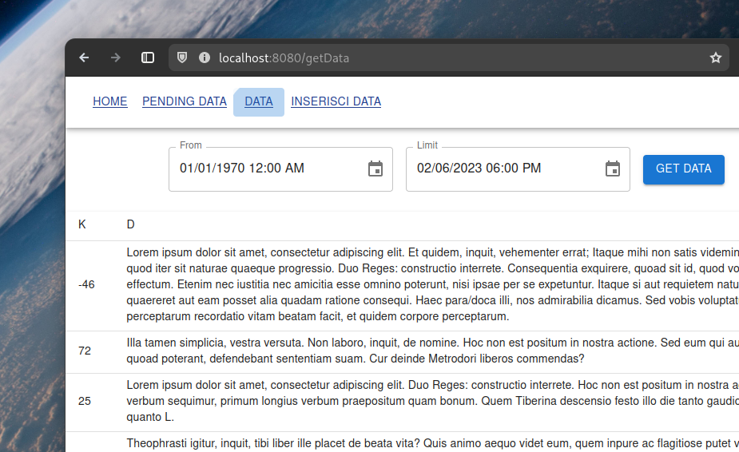

# Intern application



## Usage

```
docker-compose up -d --build
docker-compose up
```

## Commenti

Ho scelto alcune tecnologie non specificate dalla consegna: Expressjs, React, React router, Material Ui for React, React Dropzone, MySql, Multer, Webpack. Ho sviluppato con un watcher per l'update di file sorgente, Nodemon.  
Il risultato per l'utente è una single-page-application che rispetta il Material Design.
Dal lato api, per via della richiesta ` il processing dei dati deve avvenire in blocchi di massimo 15 messaggi ogni 10 secondi`, ho realizzato un daemon che si occupa di fare un round-up-check della cache in ordine di priorità, per poi riversare nel database le informazioni taggandole con un timestamp.  
Per finalità di test, il file di utility per la generazione di file da caricare è `./utility.js` e il suo usage è `node utility.js <filename>`. Il server node si connette al database da `127.0.0.1` per finalità di debugging, così si può avviare il container mysql singolarmente (`docker compose up -d db`). Altrimenti, per il caso production-ready, ci si può connettere dal nome `db` che è risolto automaticamente da Docker.  
