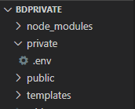
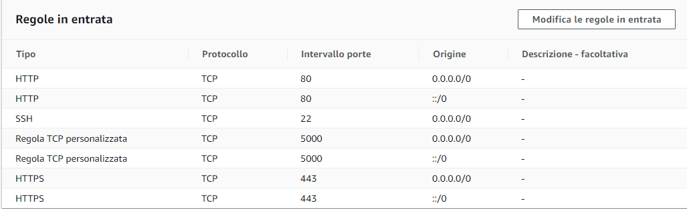
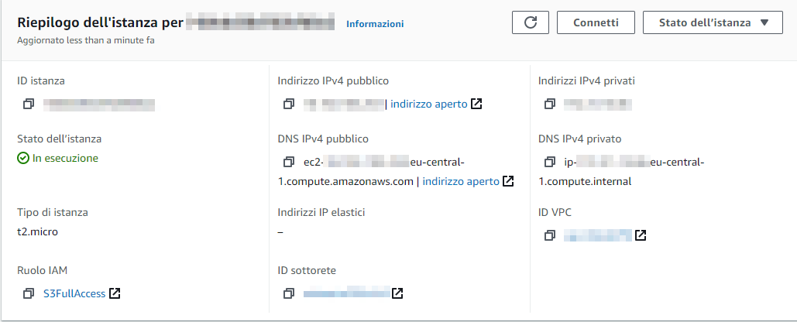

#  BassaDefinizione

> BassaDefinizione is a React project created for my candidacy for [Soluzioni Futura](https://github.com/soluzionifutura/sf-academy/blob/master/README.md). In particular, the path I have chosen is [Movie Review](https://github.com/soluzionifutura/sf-academy/blob/master/prove/recensioni-film.md) medium difficulty and skills of web applications development.

## Description

Through BassaDefinizione the user can:

- Search for a movie
- Like or dislike a movie
- Register and log
- Display in descending order of the evaluation rated films

### External APIs

Any information on any film is obtained from [OMDb API](http://www.omdbapi.com/), through a GET request in which an identification key must be specified

## Installation


Open the terminal and clone this folder

```bash
 $ git clone https://github.com/TheGodMorel/BassaDefinizione
```

Then install the [NPM packages](https://www.npmjs.com/)

```bash
 $ npm install
```

## Connection to the database

To allow the creation and connection to the database is necessary:

1. Create an [AWS Account](https://portal.aws.amazon.com/billing/signup#/start)
2. Create a new database using [Amazon RDS](https://eu-central-1.console.aws.amazon.com/rds/home)
3. Connect the RDS database to a local one
   - The name must be the same
   - Enter the RDS database endpoint as the local database Hostname
   - Leave as port 3306
4. Now that the database is ready, proceed to create cloned folder in another folder called <i>private</i> inside which the file will go <i>.env</i>
   <br>
5. In this file insert:
   - **OMDBKEY**: unique key to access the OMDB API
   - **DB_HOST**: endpoint of the RDS database
   - **DB_USER**: name used in the database
   - **DB_PASSWORD**: password used in the database
   - **DB_DATABASE**: name of the database
   - **JWT_SECRETKEY**: key to encrypt a JWT
   - **JWT_EXPIRES_IN**: expiration time of a JWT
   - **COOKIE_EXPIRES_IN**: expiration time of a cookie (used to save the JWT)
     For more information see [this video](https://www.youtube.com/watch?v=Ng_zi11N4_c&t=1s)
     ** Example ** of _.env_ file:
   ```javascript
      OMDBKEY = keyOmdbApi
      DB_HOST = nomedatabase.codice.eu-central-1.rds.amazonaws.com
      DB_USER = admin
      DB_PASSWORD = password
      DB_DATABASE = nomedatabase
      JWT_SECRETKEY = secretkey
      JWT_EXPIRES_IN = 90d
      COOKIE_EXPIRES_IN = 90
   ```

## Local IP 127.0.0.0

Following these two simple steps the site will only be visible in the local IP 127.0.0.0

```bash
  $ cd BassaDefinizione
  $ node index.js
```

## Creating an Amazon EC2 Instance

To have a global IP address instead, you need to:

1. Create an [EC2 instance](https://eu-central-1.console.aws.amazon.com/ec2)
   - Role: S3FullAccess
   - Inbound rules: 
   - Security Group for HTTP and SSH
   - Define and download an SSH key
2. This should be the final configuration of the instance: <br> 
3. Move the file containing the SSH key into the folder _BassaDefinizione_  In the example the file is _bassadefinizione.pem_

## Link to Amazon EC2

1. Connect the folder to the EC2 instance via [PuTTY](https://www.youtube.com/watch?v=bi7ow5NGC-U)
2. Run these commands to insert the BassaDefinizione folder into the instance:
   ```bash
      $ ssh ec2-user@ip-0-0-0-0 -i bassadefinizione.pem
      $ sudo su
      $ cd
      $ mkdir workspace
      $ cd workspace
      $ git clone https://github.com/TheGodMorel/BassaDefinizione
      $ cd BassaDefinizione
      $ node index.js
   ```
   **Replace** 0-0-0-0 with the instance's public IPv4 address
3. The site is now visible to the public IPv4 address of the instance

## Future upgrades

- [ ] Change the password
- [ ] Advanced movie search
- [ ] A better design that doesn't look like P\*rnhub :)


## How to contribute to the project

Each new proposal is welcome.
To do it you need to follow these steps:

1. [Fork the repo](https://github.com/TheGodMorel/BassaDefinizione/fork)
2. Create a secondary branch to the master
3. Commit changes
4. Push the commit
5. Create a new Pull Request

## License

[MIT](https://choosealicense.com/licenses/mit/)
